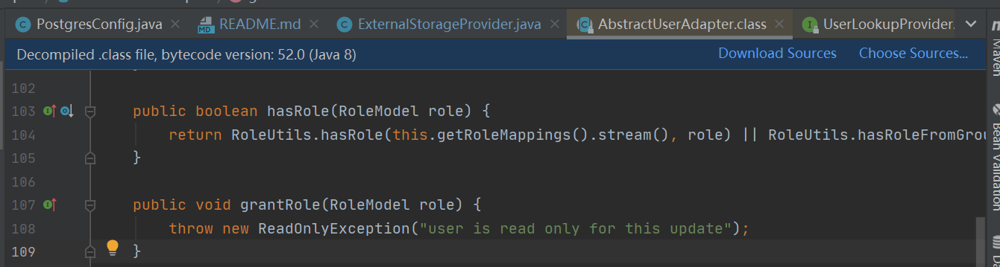

# KeyCloak-SSO
### 1. 功能说明

keycloak的spi接口实现，该spi完成了对接postgre外部数据库，使用postgre数据库中的用户信息来进行登录验证，并给用户赋予角色，赋予自定义属性,并且可以自定义数据库连接url和表名（自定义配置）。 

关于如何配置，如下图所示：


### 2.如何使用

项目克隆拉取下来之后，你只需要编译并且打包即可。但需要注意的是，不要忘记将postgresql的驱动一同打包，不然会找不到驱动。

### 3.权限赋予

####  1)赋予keycloak中的权限

在这个spi的实现你可以看到我们创建了一个新的role并且可以对用户的角色进行任意的授予。但大多数时候，你可能只需要授予一个default_role即可，因此你可以对其进行适当的修改。

我们在keycloak的官方文档的实例中可以看到如下的授权方式：

- 首先是在keycloak控制台中创建一个角色 名为testRole

 

- 然后是在用户的Role Mappings选项卡中将testRole增加到 Assigned Roles 中


- 最后在springboot项目中的application.properties或者application.yaml增加根据角色做拦截的配置，例如：


如此，这个根据角色来做的权限区分算是初步完成，但是我们不难看到其中的问题，我们的角色名以及角色用户关系都是在控制台中完成的，这在实际开发中肯定是不可行的。因此在我们开发自定义用户中心(SPI)的时候就可以

keycloak中有一个角色系统，根据用户所拥有的role，可以限制其能访问的资源 (通过限制路径的方式限制),但是我们在使用自定义用户中心(SPI)的时候肯定想要将用户原有的角色也迁移过去，该怎么解决呢？

解决这个问题的关键在于怎么去获取realm中的角色，然后又如何给用户赋予角色，那么直接看代码吧：

```java
//创建userModel
protected UserModel createAdapter(RealmModel realm, String username , User user) {
	UserModel local = session.userLocalStorage().getUserByUsername(username, realm);
    Iterator roles = realm.getRoles().iterator();
    Iterator userRoles = local.getRoleMappings().iterator();
    boolean flag = true;
    while (userRoles.hasNext()) {//判断改用户是否已经注册了用户
                RoleModel roleModel = (RoleModel) userRoles.next();
                if (roleModel.getName().equals(user.getRoleName())) {
                    flag = false;//已经注册了角色
                }
            }        
    while (roles.hasNext()) {
                RoleModel roleModel = (RoleModel) roles.next(); 
                if (roleModel.getName().equals(user.getRoleName()) && flag) { 
                    local.grantRole(roleModel);//授予角色
                    local.grantRole(realm.getRole("defaultRole"));
                }
            } 
	return local;
}

```

从上面的代码中我们可以看到在RealmModel类的getRoles()能获取到realm中的所有角色(RoleModel)，UserModel中的getRoleMappings()会提供用户已经有了的角色。为何还需要获取用户的角色，这是因为在用户创建的时候会将默认角色授权给用户。最后调用UserModel类中的grantRole(RoleModel roleModel)进行授权。

在这个地方需要注意的是，在keycloak中UserModel的实现类有很多，有的类没有对用户进行修改的权限。所以你调用grantRole的时候会抛出一个“Read only XXX”的错误，不必担心，你只需要检查你使用的UserModel实现类是不是重写grantRole的时候关掉了写的权限。

我们可以尝试看看源码，就像这个AbstractUserAdapter类：



来看一个有写权限的AbstractUserAdapterFederatedStorage类：


他的具体实现，还要再追朔一下：


最后调用hiernate的persist()方法保存我们的修改。

可还有一个问题，这个role如果不在控制台里增加，能不能在用户需要这个role的时候在创建呢?当然是可以的，keycloak的功能还是很强大的。在这儿我封装了一个新增角色的方法，很简单，可以提供给你们参考：

```java
protected KeycloakSession session;
public ExternalStorageProvider(KeycloakSession session, ComponentModel model) {
        this.session = session;
        this.model = model;
    }
/*
**新增角色的方法
**roleName就是你想要创建的角色名
*/
private void addRole(RealmModel realm,String roleName){		
		Iterator<RoleModel> iterator=realm.getRoles().iterator();
        if (roleName==null||realm==null){
            return;
        }
        while (iterator.hasNext()){
            RoleModel roleModel=iterator.next();
            if (roleModel.getName().equals(roleName)){
                return;//已有该角色，跳过增加角色的步骤
            }
        }
        this.session.realms().addRealmRole(realm,roleName);
}
```

####  2)赋予菜单权限

不知道有没有人有这样疑问，如果我的权限是一些菜单列表之类的，显然keycloak的角色无法满足我们的需求，那该怎么办呢？在这里我提供的是采用redis来解决的方案：

- 在创建UserModel的时候，增加额外的自定义属性UserId，然后将UserId和权限信息存储在redis中(UserId为key，权限信息为value)，前端在登录成功之后根据UserId从后端的redis中获取角色信息。
- 在创建UserModel的时候，增加额外的自定义属性UserId，然后前端根据UserId获取角色信息，但这次在后端返回信息的时候处理不一样了，要先看一下这个userId是否已经有了权限信息。如果没有，还需要从数据库中获取到我们的权限信息，然后将获取到的权限信息存储到redis中。最后返回信息到前端。


那，为何要用redis？。。。只是单纯的因为redis将数据存储在内存中，所以它的速度比访问磁盘更快，而且我们存储的权限信息的数据量一般是不会太多的。所以你如果对速度没啥要求，你每次都根据UserId去数据库查询权限信息也是可以的。

最后一点，额外的自定义属性UserId，这个改怎么搞呢？不用划走百度，就在下面。

 

### 4.如何返回自己自定义的额外属性(字段)？

如图，我们在keycloak的控制台可以看到一些自定义额外的属性(例如 customattr，password ):


那么，这些自定义属性该如何获取呢，首先我们需要在实现spi的时候就要增加并设置这些属性，代码如下：

```java
UserModel local = session.userLocalStorage().getUserByUsername(username, realm);
if (local == null) {      
	local.setSingleAttribute("customattr","cusValue");//就是在这里增加了额外的属性
}
```

我们能看到，代码的实现还是很简单的，但就是这样还是没法获取到这些自定义的属性的，只是在控制台中能够看到了。想要获取到这个自定义的属性，我们还需要对这些自定义的属性做映射，如何映射呢？

我们要找到我们服务自己对应的client下的Mappers选项卡，点击create，如图：


下方的两个红箭头是已经定义好了的两个映射属性，我们点击右上角的“create”，然后根据如下图所示进行设置。


最后，我们举一个在java中我们拿到token后获取自定义属性的例子来说：

```java
RefreshableKeycloakSecurityContext session= (RefreshableKeycloakSecurityContext) request.getAttribute(KeycloakSecurityContext.class.getName());
AccessToken token=session.getToken(); 
Map<String,Object> claims=token.getOtherClaims(); 
claims.get("customattr_showname");
```

最后说明一下，我们自定义的额外属性想要获取到，需要在client中将其映射出来，然后这些映射出来的属性都会保存在token中一个claims的map中，而getOtherClaims()则正是获取了其中的claims，因而能获取到我们自定义的属性名。

